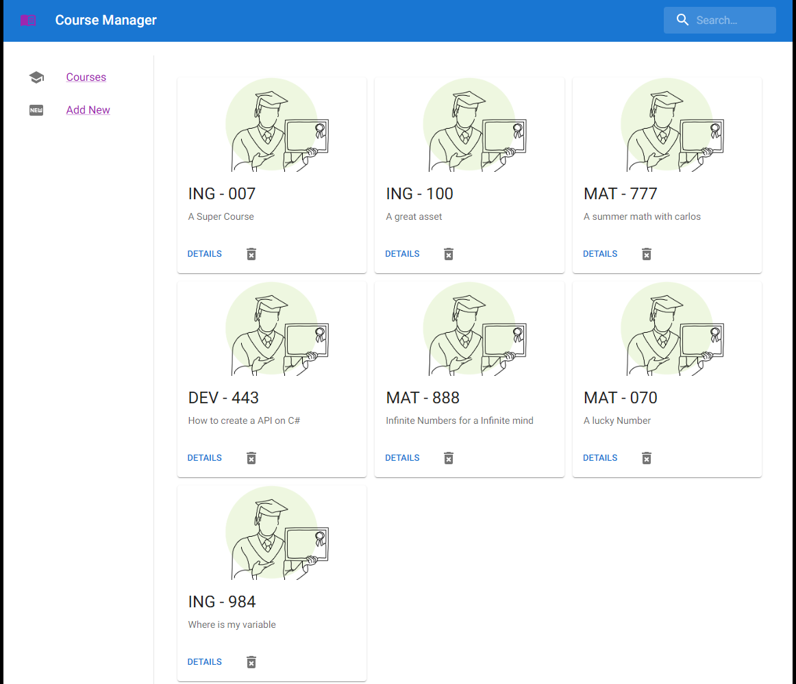

# Fake course Manager

Welcome to the “Fake Course Manager” application! This project was created as part of an assignment for a software developer position.

The application is responsible for displaying, creating, and deleting courses from a fictional Institution. It is connected to an API that verifies and executes the instructions requested by the frontend. Additionally, it is linked to a relational database.



## Stack

 The application was built using the following technologies: 

- API: Built using .NET and Entity Framework
- App: Developed with React and Next.js
- Database: Powered by PostgreSQL
    
In addition to these core technologies, we’ve also utilized complementary tools and libraries, including Redux, Material-UI (MUI), Sass, ESLint, Prettier and Docker for managing containers.

## Run App in production using docker compose

Using Docker Compose, we can spin up 3 containers: one for the .NET API, another for the PostgreSQL database, and yet another for the Next.js application. 
This way, we can easily set up a production environment to view and test our app

- require docker desktop

To run the app using docker compose simply run :

```
docker-compose up --build
```
The app will be deployed and available [http://localhost:3000](http://localhost:3000)


to stop it simply run.
```
docker-compose down
```

---

## Development requirements

Ensure you have the following tools installed:

Node.js
npm or pnpm
.NET SDK (version 8 or higher)
Docker Desktop or Docker CLI
.NET Entity Framework (for database migrations)

To install the .NET Entity Framework, use the following command:

```bash
dotnet tool install --global dotnet-ef
```

## TL;DR: Running Locally for Development 

First start the postgres db container 

```bash
docker pull postgres

docker run --name course-postgres-db -e POSTGRES_USER=dbUser -e POSTGRES_PASSWORD=dbpassword -e POSTGRES_DB=coursesdb -p 5432:5432 -d postgres
```
then start the API running

also API will create two example registers if the DB is empty.

```bash
cd ./api

dotnet run
```

finally run the frontend, to do this open a new terminal in the root directory of the project and run : 

```bash
pnpm install
pnpm run dev
```

Access the app at [http://localhost:3000](http://localhost:3000)


## Development instructions

Our app consists of three components:

- Database: Set up the PostgreSQL container.
- API: Run the .NET API
- Web App: Start the development server for the Next.js app.

### Set up and Run DB

First run de db with a docker container:

```bash
docker pull postgres

docker run --name course-postgres-db -e POSTGRES_USER=dbUser -e POSTGRES_PASSWORD=dbpassword -e POSTGRES_DB=coursesdb -p 5432:5432 -d postgres
```

if you want to interact with the container simply run 

```bash
docker exec -it course-postgres-db bash

psql -U dbUser --password --db coursesdb
```

To stop and delete the container  (warning: the db will be lost.)

```bash
docker stop course-postgres-db
docker rm course-postgres-db
```

### Run Api

then Run the dotnet API

```bash
    cd ./api
    dotnet restore
    dotnet run
```

Api will be available at (http:localhost:5020)[http:localhost:5020]

also is posible see the Api documetnation : (http://localhost:5020/swagger/)[http://localhost:5020/swagger/]

to init the database we need to use entity framework

Install dotnet-ef tool in your machine

```bash
dotnet tool install --global dotnet-ef
```

then init the db

```bash
dotnet ef migrations add InitialMigration
dotnet ef database update
```

if you need to remove it simply run 
```bash 
dotnet ef migrations remove
```

### web app

Finally, run the development server:

```bash
    npm run dev
    # or
    yarn dev
    # or
    pnpm dev
    # or
    bun dev
```

Open [http://localhost:3000](http://localhost:3000) with your browser to see the result.

## Assestment instructions
Develop simple Web application, in any language of your choosing, which manages "Course" records:
- [x]The application should manage the following information about a Course: id, subject, courseNumber, description. All fields other than id are strings
- [x]There should be a simple UI/UX to add/remove courses, search courses, and show list of current courses. This does not have to be fancy as we are not looking for a UI Designer.
- [x]The application should store data in an external database or another data storage system.

Features:
- [x] The application should allow user to search for a course by description, with partial matches like "Bio" would find "Introduction to Biology"
- [x] The application should support deleting a Course
- [x] The application should support inserting a new Course
- [x] courseNumber must be formatted as a three-digit, zero-padded integer like "033". 
- [x] Adding records which are not three-digit numbers results in an validation message to the user
- [x] The application should prevent inserting duplicate courses, where subject and number must be unique

Addtional Information:
- [x] The application must be started with minimal setup using readily available libraries (e.g. `npm start` for Node.js) and sufficiently described in a README.md
- [x] The application must be complete and sent as a zipped package over email or a github link
- [x] The application will only be tested in Google Chrome

Example Course records:
1, "BIO", 101, "Introduction to Biology"
2, "MAT", 045, "Business Statistics"

Suggestions:
- [x] Use an API to manage data and connect to the API from a front-end, Javascript application
- Show that tests have been used to validate behavior
- [x] Runnable via Docker or Kubernetes (optional)

TODO List: 
[] Show a message when the Api is not available