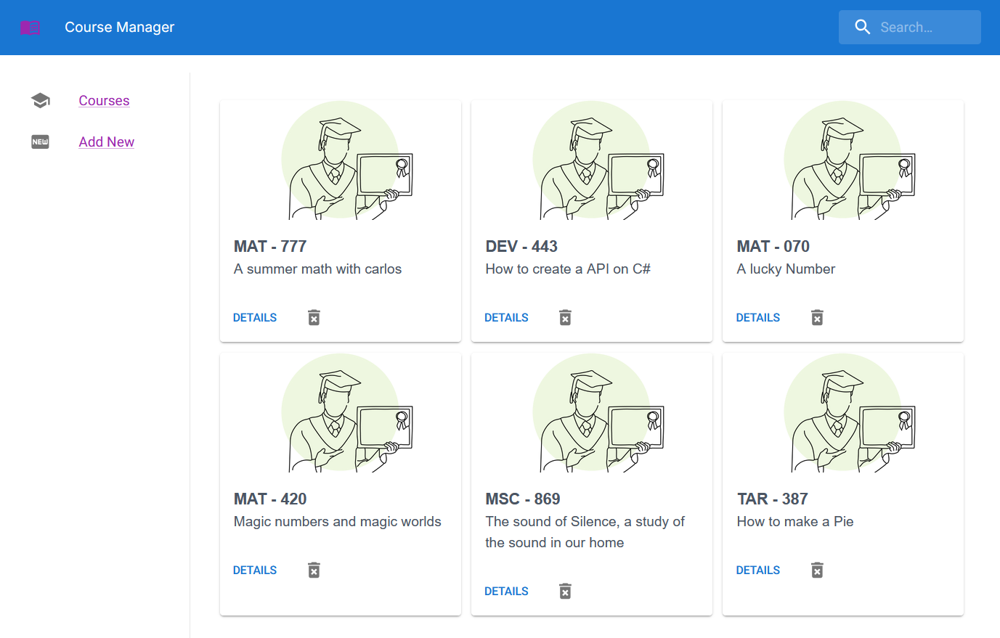

# Fake course Manager

A fake application to apply to a software developer position, the assignment deadline is 2 days. 



## Stack
 The application was built using the following technologies: 
    Api is built in .net
    App is built using React/Nextjs
    DB using Postgres

also other complementary technologies used : Redux, MUI, sass, eslint, prettier. entity framework, postgres.

## requirements

-node
-npm / pnpm
-dotnet > 8
-docker desktop / docker cli
-dotnet entity framework

to install Dotnet Entity Framework 

```bash
dotnet tool install --global dotnet-ef
```

## TL:DR Running on local 

    First start the postgres db container 

    ```bash
    docker pull postgres

    docker run --name course-postgres-db -e POSTGRES_USER=dbUser -e POSTGRES_PASSWORD=dbpassword -e POSTGRES_DB=coursesdb -p 5432:5432 -d postgres
    ```

    then using entity framework prepare our db

    ```bash
    dotnet ef database update
    ```

    then start the API running
    also API will create two example registers if the DB is empty.

    ```bash
    dotnet run
    ```

    finally run the frontend

    ```bash
    pnpm install
    pnpm run dev
    ```
    the app is served at [http://localhost:3000](http://localhost:3000)

## development instructions

We need to run 3 components for our app 
- Database
- API
- WebApp

### Run DB

First run de db with a docker container:

```bash
docker pull postgres

docker run --name course-postgres-db -e POSTGRES_USER=dbUser -e POSTGRES_PASSWORD=dbpassword -e POSTGRES_DB=coursesdb -p 5432:5432 -d postgres
```

if you want to interact with the container simply run 

```bash
docker exec -it course-postgres-db bash

psql -U dbUser --password --db coursesdb
```

To stop and delete the container  (warning: the db will be lost.)

```bash
docker stop course-postgres-db
docker rm course-postgres-db
```

### Run Api

then Run the dotnet API

```bash
    cd ./api
    dotnet restore
    dotnet run
```

Api will be available at (http:localhost:5020)[http:localhost:5020]

also is posible see the Api documetnation : (http://localhost:5020/swagger/)[http://localhost:5020/swagger/]

to init the database we need to use entity framework

Install dotnet-ef tool in your machine

```bash
dotnet tool install --global dotnet-ef
```

then init the db

```bash
dotnet ef migrations add InitialMigration
dotnet ef database update
```

if you need to remove it simply run 
```bash 
dotnet ef migrations remove
```

### web app

Finally, run the development server:

```bash
    npm run dev
    # or
    yarn dev
    # or
    pnpm dev
    # or
    bun dev
```

Open [http://localhost:3000](http://localhost:3000) with your browser to see the result.

## Assestment instructions
Develop simple Web application, in any language of your choosing, which manages "Course" records:
- [x]The application should manage the following information about a Course: id, subject, courseNumber, description. All fields other than id are strings
- [x]There should be a simple UI/UX to add/remove courses, search courses, and show list of current courses. This does not have to be fancy as we are not looking for a UI Designer.
- [x]The application should store data in an external database or another data storage system.

Features:
- [x] The application should allow user to search for a course by description, with partial matches like "Bio" would find "Introduction to Biology"
- [x] The application should support deleting a Course
- [x] The application should support inserting a new Course
- [x] courseNumber must be formatted as a three-digit, zero-padded integer like "033". 
- [x] Adding records which are not three-digit numbers results in an validation message to the user
- [x] The application should prevent inserting duplicate courses, where subject and number must be unique

Addtional Information:
- [x] The application must be started with minimal setup using readily available libraries (e.g. `npm start` for Node.js) and sufficiently described in a README.md
- [x] The application must be complete and sent as a zipped package over email or a github link
- [x] The application will only be tested in Google Chrome

Example Course records:
1, "BIO", 101, "Introduction to Biology"
2, "MAT", 045, "Business Statistics"

Suggestions:
- [x] Use an API to manage data and connect to the API from a front-end, Javascript application
- Show that tests have been used to validate behavior
- Runnable via Docker or Kubernetes (optional)
